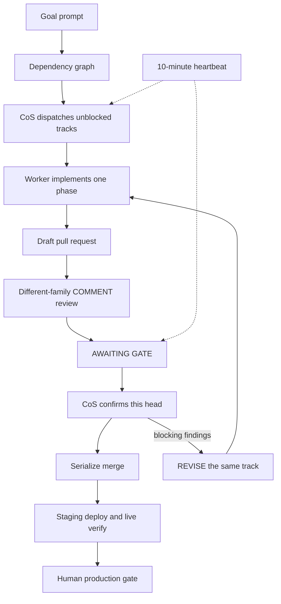

# Controller Playbook

A public method for shipping products with a **Chief of Staff** plus a **pool of worker CLIs**, instead of one long-lived coding session.

This repository is the method. It is not a personal fleet inventory: no names, no IPs, no private host tables. The same loop runs on a laptop or on many machines.

Site: [playbook.cortexagents.ai](https://playbook.cortexagents.ai). DNS is the registrar or dashboard. An in-repo `CNAME` file is not DNS. `wrangler dns` does not exist.

## Why this route

A single immortal CLI session fails in predictable ways:

- The session dies, compact, or drifts, and the goal dies with it.
- The same model that wrote the change reviews the change.
- Parallel work collides in one checkout.
- Nobody is awake when a chat turn ends, so a stuck track stays stuck.
- Merge, staging, and production get treated as one blob called "done."

A Chief of Staff (CoS) owns the goal and the gates. Workers implement one phase at a time in isolated git worktrees. A **different model family** reviews the pull request as a GitHub `COMMENT`, never as Approve. The CoS serializes merges and live-verifies staging. Production stays human-gated.

This method is used in production at CORTEX Mesh. The public tree describes the process, not the shop topology.

## Five-minute picture

1. Write a long **goal prompt**. Lock human decisions. List phases. Keep a progress log.
2. Draw a **dependency graph** before a parallel wave. Overlapping files do not run in parallel.
3. Dispatch each unblocked track to a **free worker** (`dev-1`, `ci-box`, or a laptop).
4. The worker implements **this phase**, proves it, opens a **draft PR**, runs a different-family review, and reports `AWAITING GATE`.
5. The CoS confirms the COMMENT covers **this head**, clobber-checks, waits for exact-head CI, then merges one PR at a time.
6. Staging is live-verified. Production is a human step.

## One-machine path

A laptop-only worker pool is valid. Fill the table with one row:

| Host | SSH | Fit | Max parallel tracks |
| --- | --- | --- | --- |
| `dev-1` | `user@host` or local | General coding | 1 |

Still use a dedicated git worktree per track. Still split implementer and reviewer. Still heartbeat while a track is running. The pool size is an operations choice, not a requirement of the method.

## How to start

1. Read [docs/design.md](docs/design.md) for roles, gates, anti-churn, and the human-stop list.
2. Read [docs/architecture.md](docs/architecture.md) for the architecture and one-track sequence.
3. Choose a controller identity in [playbooks/README.md](playbooks/README.md).
4. Copy [skills/goal-prompt/SKILL.md](skills/goal-prompt/SKILL.md) (and the Grok variants if that is your controller) into your agent skills path. Those skills require `scripts/pr-size-check` before a draft PR: over cap is `AWAITING SPLIT`, not GATE.
5. Author a goal from [examples/sample-goal-prompt.md](examples/sample-goal-prompt.md). Swap Harbor for your product. Replace `dev-1` / `dev-2` with your hosts.
6. Keep a [meta-repo](docs/meta-repo.md) as a map, not as the product. Never publish a `.private/` directory.

## Playbooks

| Controller | Implementer | Reviewer | Doc |
| --- | --- | --- | --- |
| Any | Isolated worker CLI | Different family from the writer | [playbooks/general.md](playbooks/general.md) |
| Claude | Worker CLI (often Codex) | Opus | [playbooks/claude.md](playbooks/claude.md) |
| Codex | Codex CLI | `gpt-5.6-sol` / high | [playbooks/codex.md](playbooks/codex.md) |
| Grok Bot | Grok CLI `grok-4.6` | `gpt-5.6-sol` / high COMMENT | [playbooks/grok.md](playbooks/grok.md) |

## Docs

- [Design](docs/design.md) — roles, loop, gates, anti-churn, human-stop
- [Architecture](docs/architecture.md) — mermaid architecture and sequence
- [Meta-repo](docs/meta-repo.md) — map vs product repos
- [Method ADRs](docs/adr/README.md)
- [Sample dependency graph](examples/sample-dependency-graph.md)

## Pages

GitHub Pages deploys from `main` via [`.github/workflows/pages.yml`](.github/workflows/pages.yml). The `CNAME` file is exactly `playbook.cortexagents.ai`. Enabling the custom domain and applying DNS are operator steps at the registrar or dashboard. This repository does not change DNS. `wrangler dns` does not exist.

## License

[MIT](LICENSE) © CORTEX Mesh contributors.
