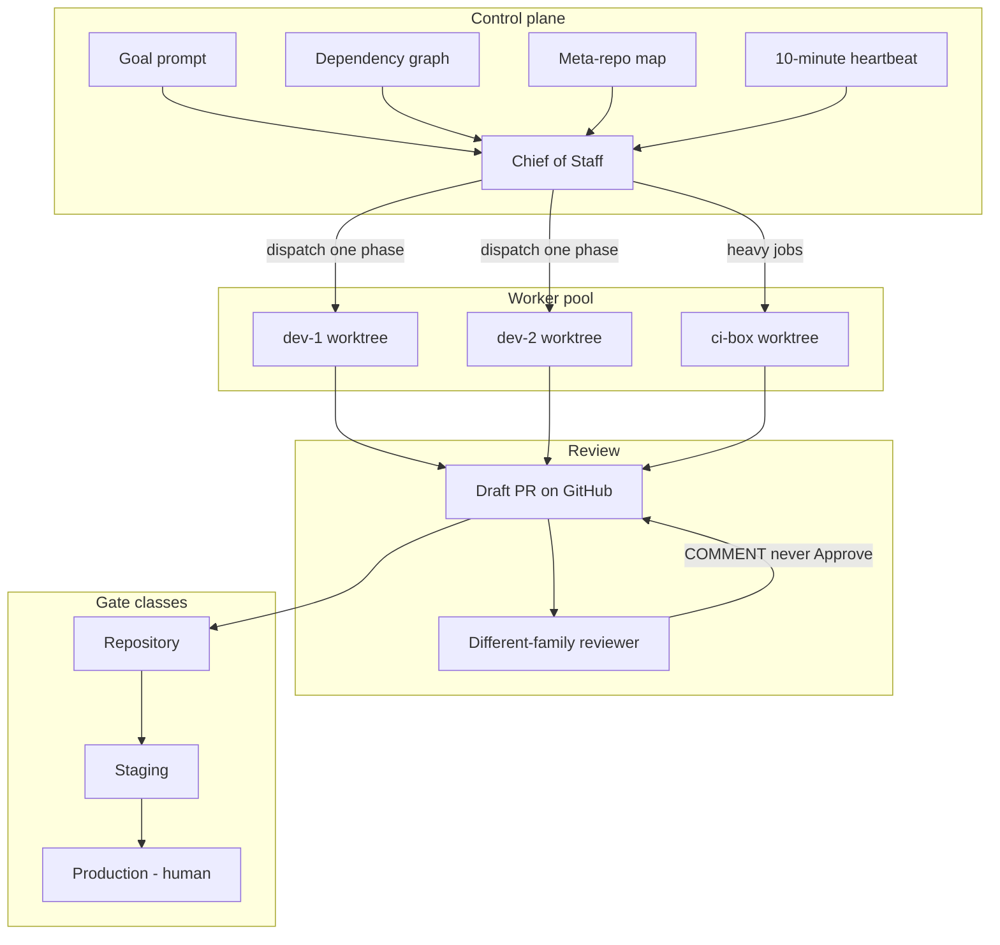
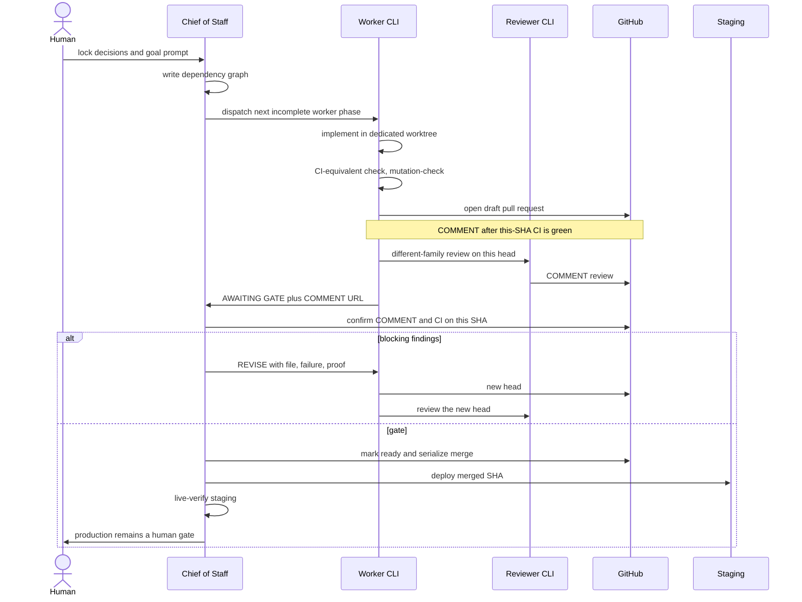

# Architecture

The playbook is a control loop around ordinary git repositories. Nothing here replaces your product architecture.

## System

- The **goal prompt** is the standing instruction every fresh session re-reads.
- The **meta-repo** is a map of products, ADRs, and runbooks. It is not the product.
- Each **worker** owns one git worktree on one host. A laptop-only pool is one host with many worktrees, still one track per worktree.
- **Review** is a different process and a different model family from the writer.
- **Production** is outside the worker's autonomy.

## One-track sequence

## Track artifact

Every live track should be nameable from the graph. Keep assigned host (after failover), tmux or gone, log path, draft PR, head SHA, COMMENT URL, gate class, CoS-may-do, and login/preflight current. See [the sample graph](../examples/sample-dependency-graph.md).

| Field | Example |
| --- | --- |
| Track | `harbor-berth-api` |
| Assigned host | `dev-2` after failover (`dev-1` logged out) |
| Login / preflight | `grok` + `gh` logged in on the assigned host |
| Tmux | gone — infer GATE from git/PR; do not re-dispatch |
| Log path | `$HOME/.grok/logs/harbor-berth-api.log` |
| Worktree | a path on that host, never the shared default-branch checkout |
| Branch | `feat/berth-api` |
| Base SHA | the default-branch SHA at dispatch |
| Draft PR | `example-app#12` (draft) |
| Head SHA | `abc1234` (pinned) |
| COMMENT URL | the COMMENT review on this head |
| Input contract | ADR-0001 accepted; schema from track A |
| Overlaps | none with `harbor-web-shell` |
| Gate class | repository |
| Repo gate | CI-equivalent check, COMMENT after this-SHA CI, CI on this SHA |
| Staging gate | CoS-only after merge; live GET `/health` |
| CoS may do without a human | rebase, COMMENT confirm, `gh pr ready`, merge, staging verify |
| Status file | worker-written; CoS reads ([schema](../examples/status.schema.yaml)) |
| GATE log | append-only DISPATCH / REVISE 1–3 / SPLIT / GATE / HUMAN |

## Watchdog

The CoS cannot sit in one turn forever. A 10-minute routine (or a tmux watchdog that only repeats an authorized step) keeps the loop moving:

- Heartbeat while implementing or in CI (dual timestamps), including "still working." Every CoS-visible message starts with WORKING, WAITING ON YOU, or BLOCKED.
- `AWAITING GATE` in the graph is the repo gate. The human-visible line is `WAITING ON YOU: merge PR #N` (or accept residual / unlock REVISE). Do not go quiet after one notice.
- Inspect tmux, git, PR head, and CI. Read the worker [status file](../examples/status.schema.yaml) and the [GATE log](../examples/sample-gate-log.tsv). Do not invent state from tmux. A missing pane is not a dead track; infer GATE from draft PR + COMMENT on this head + SHA. Do not re-dispatch.
- Take the next already-authorized repo-safe step. Do not become the implementer when dispatch fails.
- Do not double-dispatch a progressing track.
- Same blocker: (1) evidence, (2) one REVISE, (3) stop the track and escalate. No attempt 4. Independent tracks continue.

See [ADR 0007](adr/0007-watchdog-heartbeat.md).
