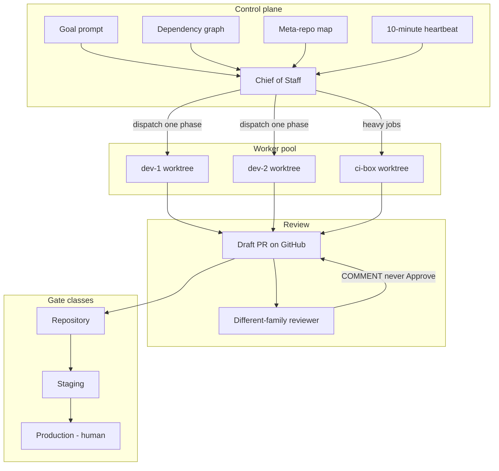
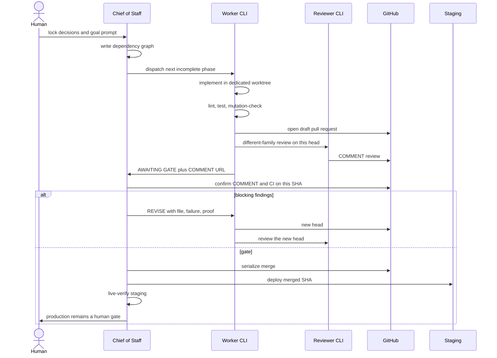

# Architecture

The playbook is a control loop around ordinary git repositories. Nothing here replaces your product architecture.

## System

- The **goal prompt** is the standing instruction every fresh session re-reads.
- The **meta-repo** is a map of products, ADRs, and runbooks. It is not the product.
- Each **worker** owns one git worktree on one host. A laptop-only pool is one host with many worktrees, still one track per worktree.
- **Review** is a different process and a different model family from the writer.
- **Production** is outside the worker's autonomy.

## One-track sequence

## Track artifact

Every live track should be nameable from the graph:

| Field | Example |
| --- | --- |
| Track | `harbor-berth-api` |
| Host | `dev-1` |
| Worktree | a path on that host, never the shared default-branch checkout |
| Branch | `feat/berth-api` |
| Base SHA | the default-branch SHA at dispatch |
| Input contract | ADR-0001 accepted; schema from track A |
| Overlaps | none with `harbor-web-shell` |
| Repo gate | lint, test, COMMENT, CI on this SHA |
| Staging gate | merge after track A; live GET `/health` |
| CoS may do without a human | rebase, COMMENT confirm, merge, staging verify |

## Watchdog

The CoS cannot sit in one turn forever. A 10-minute routine (or a tmux watchdog that only repeats an authorized step) keeps the loop moving:

- Heartbeat while any track is running, including "still working."
- Inspect tmux, git, PR head, and CI.
- Take the next already-authorized repo-safe step.
- Do not double-dispatch a progressing track.
- After three documented attempts at the same blocker, escalate and stop that track.

See [ADR 0007](adr/0007-watchdog-heartbeat.md).
