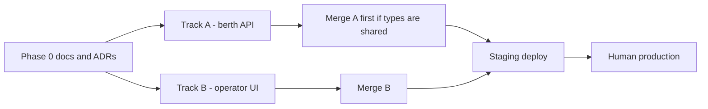

# Sample dependency graph — Harbor v1

Fictional wave. Two tracks may run in parallel because they do not share files.
Staging waits for both merges.

| Field | Track A | Track B |
| --- | --- | --- |
| Name | `harbor-berth-api` | `harbor-operator-ui` |
| Host | `dev-1` | `dev-2` |
| Branch | `feat/berth-api` | `feat/operator-ui` |
| Base SHA | default-branch tip at dispatch | default-branch tip at dispatch |
| Worktree | dedicated, not the shared checkout | dedicated, not the shared checkout |
| Inputs | Phase 0 ADRs accepted | Phase 0 ADRs; API types from Track A **or** a stub contract ADR |
| Overlapping files | `src/api/**`, `src/lib/berths.ts` | `src/ui/**` only |
| Parallel? | yes, if the contract ADR is already merged | yes, same condition |
| Repo gate | lint, test, mutation on conflicts, COMMENT, CI | lint, test, COMMENT, CI |
| Staging gate | after merge; `GET /health` | after merge; create reservation in UI |
| CoS may do without a human | rebase, confirm COMMENT, merge, staging verify | same |
| Human only | production DNS, prod secrets | production DNS, prod secrets |

## Clobber rules

- If Track B needs a type that Track A still owns, **do not** start B until that type lives in a merged ADR or a merged API package.
- If both tracks touch `package.json` or a generated client, serialize them.
- After A merges, rebase B before review. Re-run COMMENT on the new head.

## Merge order

1. Track A if it owns the HTTP contract.
2. Track B.
3. Watch default-branch CI.
4. Deploy staging at the merged SHA.
5. Live-verify. Stop. Production is not in this wave.
