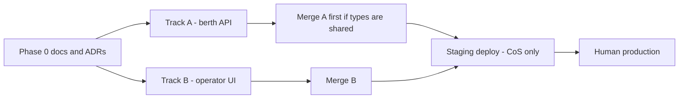

# Sample dependency graph — Harbor v1

Fictional wave. Each phase is one graph node, one PR, and one mergeable outcome.
Two tracks may run in parallel because they do not share files. Staging waits
for both merges and is CoS-only.

Phase 0 is a short phased ADR (stack, tenancy) because the *shape* of the
system is new. It lists Phases 1–2 so later tracks cannot collapse API+UI into
one PR. A rename or lockfile bump would not get an ADR.

Living snapshot after dispatch. Update these fields in place as the wave moves.

| Field | Track A | Track B |
| --- | --- | --- |
| Name | `harbor-berth-api` | `harbor-operator-ui` |
| Goal phase | Phase 1 — Berth API | Phase 2 — Operator UI |
| Mergeable outcome | slips + reservations CRUD and conflict rule | list slips, create reservation, show conflicts |
| Assigned host | `dev-2` (failover from `dev-1`) | `ci-box` |
| Login / preflight | `dev-1` logged out — skipped. `dev-2`: `grok` + `gh` logged in | `ci-box`: `grok` + `gh` logged in |
| Tmux | gone — infer GATE from git/PR; do not re-dispatch | alive, `remain-on-exit` on |
| Log path | `$HOME/.grok/logs/harbor-berth-api.log` | `$HOME/.grok/logs/harbor-operator-ui.log` |
| Branch | `feat/berth-api` | `feat/operator-ui` |
| Base SHA | default-branch tip at dispatch | default-branch tip at dispatch |
| Worktree | dedicated, not the shared checkout | dedicated, not the shared checkout |
| Inputs | Phase 0 ADRs accepted | Phase 0 ADRs; API types from Track A **or** a stub contract ADR |
| Overlapping files | `src/api/**`, `src/lib/berths.ts` | `src/ui/**` only |
| Blast radius | one subsystem: berth API (`src/api/**`, `src/lib/berths.ts`) | one subsystem: operator UI (`src/ui/**`) |
| Split | none — one outcome | none — one outcome |
| Parallel? | yes, if the contract ADR is already merged | yes, same condition |
| Draft PR | `example-app#12` (draft) | `example-app#13` (draft) |
| Head SHA | `abc1234` (pinned `commit_id`) | `def5678` (pinned `commit_id`) |
| COMMENT URL | `https://github.com/example/example-app/pull/12#pullrequestreview-1` | pending worker COMMENT on this head |
| Gate class | repository | repository |
| Repo gate | CI-equivalent check, mutation on conflicts, COMMENT after this-SHA CI | CI-equivalent check, COMMENT after this-SHA CI |
| Staging gate | CoS-only after both merges; `GET /health` | CoS-only after both merges; create reservation in UI |
| CoS may do | rebase, confirm COMMENT, `gh pr ready`, merge, staging verify | same |
| Human only | production DNS, prod secrets | production DNS, prod secrets |

## Clobber rules

- If Track B needs a type that Track A still owns, **do not** start B until that type lives in a merged ADR or a merged API package.
- If both tracks touch `package.json` or a generated client, serialize them.
- After A merges, rebase B before review. Re-run COMMENT on the new head.
- A missing tmux pane is not a dead track. Do not re-dispatch when git/PR already show draft + COMMENT on this SHA.

## Split rules

- Grouping first: one node = one outcome. "The whole feature" is already too big — write phases in this table and the goal prompt before anyone codes. Mapping: phase N → this node → one PR → one outcome. A worker must not add a second outcome to the same PR.
- Soft: two or more subsystems is already two tracks. Write that split in this table before anyone codes. A mixed "berth API + IAM + compose/runtime" wave is not one track. File count is a graph smell, not a cap: split when the file list spans two or more subsystems, regardless of loc. High file count with a small product diff (renames, import paths) is still reviewable.
- Hard (backstop): ≥800 added product lines (see [general.md](../playbooks/general.md#pr-size)) is `AWAITING SPLIT`, not `AWAITING GATE`. Update this table and re-dispatch. There is no "justify the megadiff." File count alone does not fail GATE.

## Merge order

1. Track A if it owns the HTTP contract. CoS marks the draft ready after GATE.
2. Track B. Same. Workers never `gh pr ready`.
3. Watch default-branch CI.
4. CoS deploys staging at the merged SHA. Do not dispatch staging as a worker phase.
5. Live-verify. Stop. Production is not in this wave.
