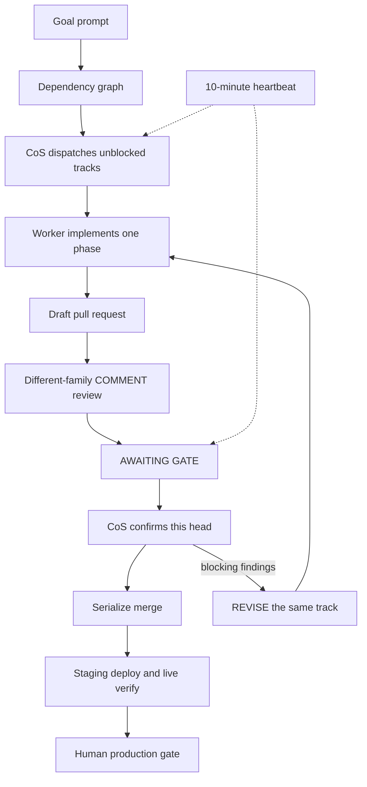

# Controller Playbook

A public method for shipping products with a **Chief of Staff** plus a **pool of worker CLIs**, instead of one long-lived coding session.

This site is the method. It is not a personal fleet inventory: no names, no IPs, no private host tables. The same loop runs on a laptop or on many machines.

Source: [github.com/cortex-mesh/controller-playbook](https://github.com/cortex-mesh/controller-playbook). DNS is the registrar or dashboard. An in-repo `CNAME` file is not DNS. `wrangler dns` does not exist.

## Why this route

A single immortal CLI session fails in predictable ways:

- The session dies, compact, or drifts, and the goal dies with it.
- The same model that wrote the change reviews the change.
- Parallel work collides in one checkout.
- Nobody is awake when a chat turn ends, so a stuck track stays stuck.
- Merge, staging, and production get treated as one blob called "done."

A Chief of Staff (CoS) owns the goal and the gates. Workers implement one phase at a time in isolated git worktrees. A **different model family** reviews the pull request as a GitHub `COMMENT`, never as Approve. The CoS serializes merges and live-verifies staging. Production stays human-gated.

This method is used in production at CORTEX Mesh. The public tree describes the process, not the shop topology.

## Five-minute picture

1. Write a long **goal prompt**. Lock human decisions. List phases. Keep a progress log.
2. Draw a **dependency graph** before a parallel wave. Overlapping files do not run in parallel.
3. Dispatch each unblocked track to a **free worker** (`dev-1`, `ci-box`, or a laptop).
4. The worker implements **this phase**, runs the product repo CI-equivalent check, opens a **draft PR**, waits for this-SHA CI, runs a different-family review, and reports `AWAITING GATE`.
5. The CoS confirms the COMMENT covers **this head**, clobber-checks, waits for exact-head CI, then merges one PR at a time.
6. Staging is live-verified. Production is a human step.

## One-machine path

A laptop-only worker pool is valid. Fill the table with one row:

| Host | SSH | Fit | Max parallel tracks |
| --- | --- | --- | --- |
| `dev-1` | `user@host` or local | General coding | 1 |

Still use a dedicated git worktree per track. Still split implementer and reviewer. Still heartbeat while a track is running. The pool size is an operations choice, not a requirement of the method.

## Start here

- [Design](docs/design.md) — roles, gates, anti-churn, human-stop list
- [Architecture](docs/architecture.md) — architecture and one-track sequence
- [Playbooks](playbooks/README.md) — choose by controller identity
- [Goal-prompt skill](skills/goal-prompt/SKILL.md) — author the standing instruction
- [Sample Harbor goal](examples/sample-goal-prompt.md) — fictional product, placeholder workers
- [Meta-repo](docs/meta-repo.md) — map, not product
- [Method ADRs](docs/adr/README.md)

## License

MIT © CORTEX Mesh contributors.
